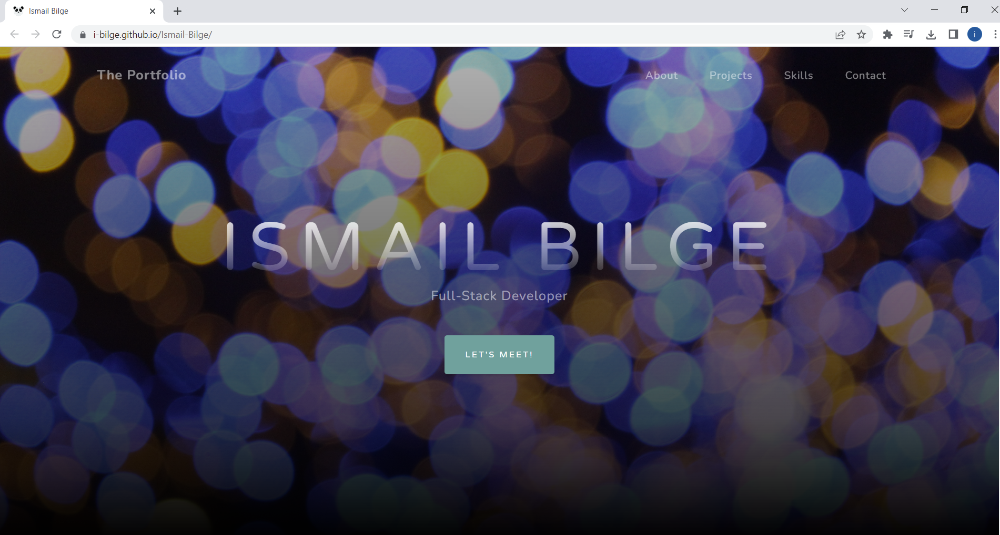
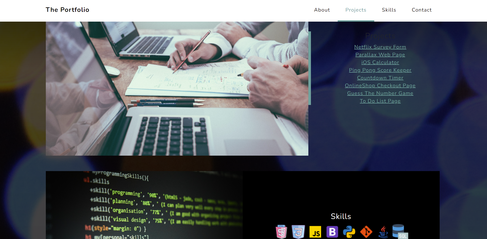

#  :wave: Ismail-Bilge :panda_face:
> Thi is my portfolio website, which gives you informations about me and my works!

## Table of contents
  - [Table of contents](#table-of-contents)
  - [General info](#general-info)
  - [Technologies](#technologies)
  - [Features](#features)
  - [How to use](#how-to-use)
  - [Screenshots](#screenshots)
  - [Contact](#contact)

## General info
This project is created to explain myself as a developer better and publish my works. And in this Project Bootstrap is used oftly to make styling.

## Technologies
* HTML5
* CSS3
* JavaScript
* Bootstrap

## Features
* Use the navigation bar to find everything easier
* Click on Projects to see what i have done
* You can find contact informations at the end
* There are also links of GitHub, HackerRank and Xing accounts

## How to use
# Click on this link:

## Screenshots

## Contact
:mailbox_with_mail: You can send me email : iismailbilge@gmail.com :mailbox_with_mail:
